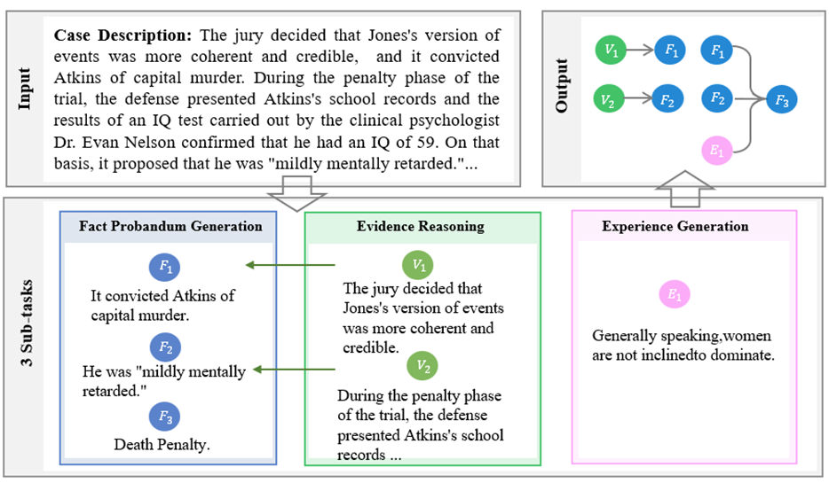

# Law Reasoning Benchmark
A Law Reasoning Benchmark for LLM with Tree-Organized Structures including Factum Probandum, Evidence and Experiences

**Abstract:** While progress has been made in legal applications, law reasoning, crucial for fair adjudication, remains unexplored. We propose a transparent law reasoning schema enriched with hierarchical factum probandum, evidence, and implicit experience, enabling public scrutiny and preventing bias. Inspired by this schema, we introduce the challenging task, which takes a textual case description and outputs a hierarchical structure justifying the final decision. We also create the first crowd-sourced dataset for this task, enabling comprehensive evaluation. Simultaneously, we propose an agent framework that employs a comprehensive suite of legal analysis tools to address the challenge task. This benchmark paves the way for transparent and accountable AI-assisted law reasoning in the "Intelligent Court".

# Transparent Law Reasoning Agent
We have provided the source code of our TL Agent system. For more details, please refer to the [TLAgent](./TLAgent/). You can understand the system structure and specific installation and configuration tutorials through [README.md](./TLAgent/README.md).

# Dataset
Coming soon...

# Evaluation
We provide a test dataset and evaluation scripts for users to evaluate model performance. The test dataset can be found at [test dataset](./dataset/test/). For detailed information about the dataset, please refer to [dataset introduction](./dataset/README.md). Additionally, we offer [evaluation scripts](./eval/) to evaluate the model's performance on this benchmark.

