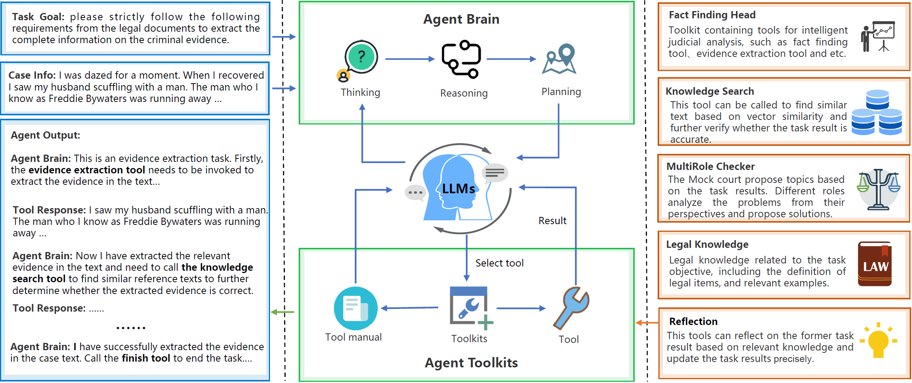

# Transparent Law Reasoning Agent



## File Directory
```
TLAgent
│   README.md 
│   config.yaml # Project Configuration
│   alembic.ini # PostgreSQL DB Setting    
│
└───migration # DB Initialization Dir
|
|
└───experiments
│   
│    
└───tfagent # main directory
│    │   worker.py # Agent asynchronous working script 
│    │
│    └─── exp_controllers # TF_agent working folder 
│    │
│    └─── tools # agent tools folder
│    │
│    └─── models # DB Schema 
│    │
│    └─── jobs # agent execution script
│    │
│    └─── agent
│    │
│    ...
│    
└───workspace # The upload file
│    │
│    └─── input
│    │ 
│    └─── output
...
```

## Project installation

### Required Environment
```bash
Python==3.10.0
pip install -r requirements.txt
```

### Modify Configuration File
Configure Redis and PostgreSQL paths in config.yaml.
It's recommended to install Redis on a Linux system.

### Sync PostgreSQL Database
```bash
alembic upgrade head
```

### Create Users and Organizations
```bash
python tfagent/exp_controllers/addUserwithorg.py
```

### Add Model API to the Corresponding Organization
```bash
python tfagent/exp_controllers/addmodelwithAPIkey.py
```

### Import Custom Agent Workflow into the Database
```bash
python tfagent/exp_controllers/addworkflows.py
```

### Import Toolset into the Database
```bash
python tfagent/exp_controllers/addtoolkits.py
```
### Start Celery
Start Celery 4.x on Linux
```bash
celery -A tfagent.worker worker --beat --loglevel=info
```

Start Celery 4.x+ on Windows
```bash
pip install eventlet
celery -A tfagent.worker worker --loglevel=info -P eventlet
```

### Send Task function to Celery Service
```bash
python tfagent/exp_controllers/tf_creater.py
```

## Experiments

You need to execute all the steps in the task to complete the entire task.

### Task1

```bash
python experiments/main_agent_task1.py --step1
```

### Task2

```bash
python experiments/main_agent_task2.py --step1
```

### Task3
```bash
python experiments/main_agent_task3.py --step1
```

### Overall Evaluation
```bash
python experiments/main_agent_task3.py --step1
```

## Evaluation
We provide a test dataset and evaluation scripts for users to evaluate model performance. The test dataset can be found at [test dataset](./dataset/test/). For detailed information about the dataset, please refer to [dataset introduction](./dataset/README.md). Additionally, we offer [evaluation scripts](./eval/) to evaluate the model's performance on this benchmark.

## Acknowledgements

Our TL Agent is developed based on [SuperAGI](https://github.com/TransformerOptimus/SuperAGI).


